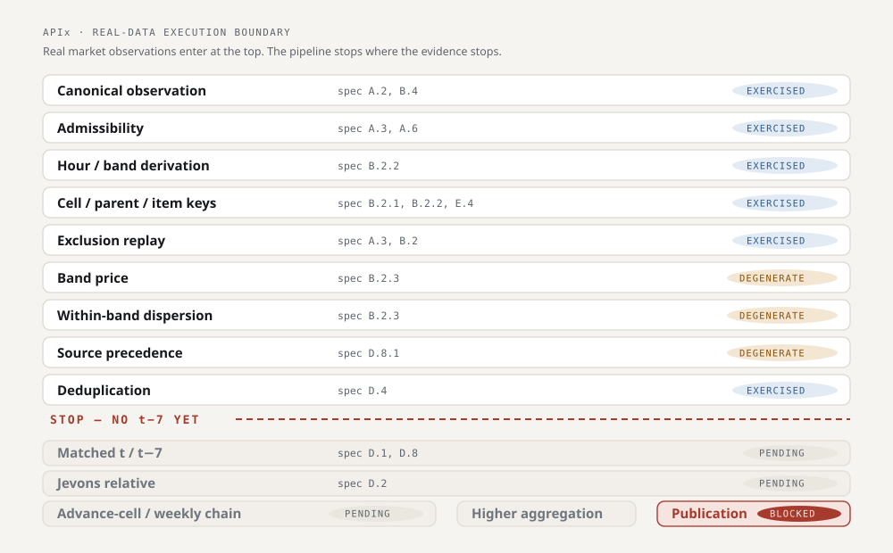

# APIx

**A quality-adjusted, high-frequency airfare price index for India — and the
auditable infrastructure that produces it.**

Built against MoSPI problem statement **26056**, Data Informatics & Innovation
Division.

> **Status — hackathon prototype, 15 September 2026.** APIx is a
> frozen-specification airfare index **engine** with a real-market evidence
> pipeline. The complete seven-bucket advance-purchase panel for DEL–BOM has
> been collected and audited under a fixed collection protocol. The engine is
> implemented and tested, but **APIx deliberately does not publish a market
> index yet**, because the longitudinal evidence the frozen methodology requires
> does not exist. See [`context/state.md`](context/state.md).
>
> | | State |
> |---|---|
> | Real observations | **35** · 7/7 frozen APW buckets · DEL–BOM · IndiGo · collected 2026-09-12 |
> | APIx-L engine | **implemented, tested** — verified end to end over 14 consecutive publication dates **of a controlled synthetic test fixture**; no real longitudinal index calculation has been executed |
> | APIx-L index value | **PENDING** — §C.1 needs matched `t / t−7`; one wave held. Unlocks 2026-09-19 |
> | APIx-TPD | **specified (§M), NOT implemented** — no estimator exists |
> | Uncertainty / CI | **NOT implemented** — no interval is reported anywhere |
> | National representativeness | **not established** — 1 route, 1 carrier |
> | Production readiness | **NOT production-ready** — one collection wave, one route, one carrier, one source; two open ambiguities (AMB-8, AMB-9) and one open question (OQ-1) |
>
> **Real market observations pass through APIx's admissibility, banding, key
> construction, deduplication and source-precedence stages. The pipeline stops at
> the longitudinal Jevons step because the required t−7 observation does not yet
> exist.** Three of those stages are **degenerate** on a single-wave, single-source
> panel, and *exercised* is not *validated*: stage-by-stage detail in
> **[docs/capability-matrix.md](docs/capability-matrix.md)**, claim-by-claim in
> **[docs/claim-evidence-matrix.md](docs/claim-evidence-matrix.md)**.

---

## ⚠ AgentOS is development infrastructure, not APIx

This repository is *built with* **AgentOS**, a vendored engineering/review
framework. It is **not part of the APIx statistical product**, contributes
nothing to any published number, and its version numbers and readiness reports
describe **AgentOS, never APIx**.

It is large and it is visible, so to be unambiguous — the following are **AgentOS**,
not APIx:

- **Trees:** `runtime/`, `agents/`, `standards/`, `workflows/`, `checklists/`,
  `templates/`, `profiles/`, `validation/`, `integrations/`, `metrics/`,
  `examples/`, `tools/scripts/`, `production_certification/`,
  `production_validation/`, `.agentos/`
- **Root files:** `AGENTOS.md`, `ARCHITECTURE.md`, `CHANGELOG.md`,
  `DOCUMENTATION_INDEX.md`, `ENGINEERING_PRINCIPLES.md`, `REPOSITORY_HEALTH.md`,
  `RELEASE_NOTES_v1.0.0.md`, `START_PROJECT.md`, `BOOTSTRAP.md`, `INSTALL.md`,
  `TEAM_QUICKSTART.md`, `TEAM_ONBOARDING_CHECKLIST.md`, `SUPPORT.md`,
  `SECURITY.md`, `COMPATIBILITY.md`, `SUPPORTED_VERSIONS.md`,
  `VERSION_POLICY.md`, `Makefile`, `PROJECT_CONFIG*.yaml`
- **`VERSION` contains `1.0.0` — that is AgentOS's version. APIx has no release
  and no tag.** `production_certification/` certifies **AgentOS**; APIx is not
  production-certified and publishes no index.

Each of those files carries a banner saying so. **APIx itself is `src/apix/`,
`tests/`, `tools/analysis/`, `tools/collection/`, `docs/methodology/`,
`data/`, `compliance/` and `source_registry/`.**

## Demo & media

### The dashboard

**[`data/dashboard.html`](data/dashboard.html)** — the delivered jury surface: the
35 observations, the advance-purchase profile, the confound, the evidence
ladder, the exclusion replay, the execution boundary, and why no index is
published. It is generated, never hand-authored.

It loads **nothing from the network**. The three libraries and both font
families are vendored in [`data/vendor/`](data/vendor/README.md), so it renders
identically on conference wifi, on a locked-down machine, and from a `file://`
URL with the cable pulled. Open it directly, or serve the repo:

```bash
python -m http.server 8753   # then open http://127.0.0.1:8753/data/dashboard.html
```

It degrades rather than breaks: with the libraries blocked, with no script at
all, and under `prefers-reduced-motion`, every figure and every chapter is still
readable.

### Architecture

| | |
|---|---|
| [System architecture](docs/assets/architecture/apix-system-architecture.svg) | collection → evidence → canonical observations → validation → statistics → publication guard |
| [Real-data execution boundary](docs/assets/architecture/apix-execution-boundary.svg) | the 14 stages, and exactly where real data stops |
| [Current vs next wave](docs/assets/architecture/apix-current-vs-next-wave.svg) | what the second collection unlocks, and why the date is not a forecast |



### Screenshots and video

**Not yet captured.** See [`docs/assets/README.md`](docs/assets/README.md) for
why, and for the capture protocol — including the assertion that must pass
before any capture, so a screenshot can never show a statistic mid-animation.

## Repository layout

Every row states what is actually on disk today. **`EMPTY` means the package
exists as a namespace and contains no implementation** — it is a reserved slot,
not working code.

```
src/apix/
  schemas/       IMPLEMENTED  collection, enums, keys, observation, results,
                              version_vector
  ingestion/     IMPLEMENTED  store.py (SQLite snapshot store)
  statistics/    deterministic, no ML imports, invariant-tested
    elementary/  IMPLEMENTED  jevons, matching, admissibility, bands, dedup,
                              outliers, sources
    aggregation/ IMPLEMENTED  young_laspeyres, weights, within_route
    index/       IMPLEMENTED  apix_l, chaining, linking, parent, publication
    tpd/         EMPTY        SPECIFIED in methodology §M; estimator NOT written
    uncertainty/ EMPTY        bootstrap SPECIFIED; estimator NOT written
  analytics/     EMPTY        anomaly, forecasting, shock, decomposition — planned
  ai/            EMPTY        explanation, parser diagnosis — planned
  api/           EMPTY        FastAPI, SDMX serialisers — planned
  experiments/   EMPTY        six controlled scenarios — planned
dashboard-planned/  DESIGN ONLY, no code. The delivered dashboard is generated
                    HTML at data/dashboard.html, below
docs/            methodology, engineering, the dossier
tests/           architecture boundary, property and invariant tests
tools/analysis/  panel + dashboard generators, engine demo
collection-input/  the screenshot -> observation audit trail (see its README:
                   five files are load-bearing; the rest are retained provenance)
```

**The dashboard is generated, never hand-authored:**

```
data/collection/collection.sqlite3          the store (real observations)
  -> tools/analysis/build_panel_json.py
  -> data/panel.json                        the contract every renderer reads
  -> tools/analysis/build_dashboard.py      -> data/dashboard.html
  -> tools/analysis/panel_report.py         -> data/panel_report.txt

tools/analysis/engine_demo.py               engine run on a SYNTHETIC fixture
  -> data/engine-validation.html            separate file, never merged above
```

The dossier's section 13 tree is rooted at `apix/`, so those layers are the
contents of the `apix` **package**. A `src/` prefix makes that literal and stops
`statistics/` shadowing Python's standard-library module — see
[ADR-0061](artifacts/decisions/ADR-0061-statistics-package-layout.md).

## What prevents an invalid publication

APIx publishes no index today, and that is enforced by code rather than by
intention. Four guards, none of which may be weakened to obtain a number:

| Guard | Where | What it refuses |
|---|---|---|
| **§C.1 locked** | [`index/chaining.py`](src/apix/statistics/index/chaining.py) | Any index value without a matched `t / t−7` pair. One collection wave ⇒ zero matched pairs ⇒ **no index** |
| **AMB-8** | [`publish()`](src/apix/statistics/index/publication.py) takes `expected_cells_by_route` as a **required argument with no default** | Publication with an undeclared §I coverage denominator. The term "expected cells" is undefined in the frozen spec, and **no definition has been chosen** |
| **AMB-9** | [`within_route_weights`](src/apix/statistics/aggregation/within_route.py) raises `WeightError` | Multi-carrier route weighting with no declared carrier shares. *(At one carrier the allocation is mathematically degenerate — see the [capability matrix](docs/capability-matrix.md).)* |
| **§A.3 exact** | `APWBucket.from_lead_time` returns `None` | A quote whose lead time matches no frozen bucket. Lead times are **never rounded** into a bucket |

Plus [`tests/test_architecture.py`](tests/test_architecture.py), which fails the
build if anything under `src/apix/statistics/` imports `sklearn`, `lightgbm`,
`xgboost`, `torch`, `anthropic` or `openai`. **AI/ML is not a dependency of the
published statistic.**

## The problem

A fare appearing on a website is an observation. It is not automatically a price
index observation.

Airfare is the weakest measurement point in the CPI transport basket. Every
other item in its neighbourhood — rail, fuel, telephone, postage — is priced
from an administrative source with a single authoritative provider. Airfare is
the exception: collected from commercial, dynamically-priced consumer websites,
with extreme heterogeneity and no administrative feed reporting the transacted
consumer price.

A single sector can vary 200–400% within a day. **Much of that variation is not
inflation** — it is product mix: different advance-purchase windows, fare
families, departure times, baggage and refundability terms. An index built on
naive daily averages accumulates those composition effects as **chain drift**,
which is a bias, not noise. It does not average out with more data.

## The approach

Two estimators, one deterministic spine, computed from the same canonical
observations by parallel paths that are **never chained together**.

| | **APIx-L** — the headline | **APIx-TPD** — quality-adjusted |
|---|---|---|
| Method | Jevons short index at the elementary level, Young / Modified Laspeyres above | Quote-level Time Product Dummy hedonic regression, rolling window, mean-spliced |
| Character | Deterministic, formula-transparent, no ML in the code path | An estimate under a stated hedonic model |
| Purpose | A series a statistical office could adopt without changing its methodology | An independent quality-adjusted estimate of price movement |
| **Status** | **Engine implemented and tested.** No index value published — see above | **Specified (§M). Estimator NOT implemented.** |

**Design intent — not a present deliverable.** The gap between the two series is
what APIx is ultimately for: it answers how much observed airfare movement
survives conditioning on product composition, and how much does not.
**That comparison cannot be produced today.** APIx-L is blocked on a second
collection wave, and APIx-TPD has no estimator — `src/apix/statistics/tpd/` is an
empty package. Nothing in this repository currently computes a two-estimator
divergence, and no such figure is published anywhere.

## The architectural rule

```
STATISTICS CALCULATES.  ML/AI EXPLAINS.
```

Three layers with a hard boundary. The boundary is not a diagram convention — it
is enforced in CI by [`tests/test_architecture.py`](tests/test_architecture.py),
which fails the build if anything under `statistics/` imports `sklearn`,
`lightgbm`, `xgboost`, `torch`, `anthropic`, `openai`, or the layers above it.

The published index must be reproducible from
`(snapshot_id, methodology_version, weight_version, code_version)` alone.

**Removal test:** delete the Claude API integration and the entire analytics
layer. Collection, cleaning, deduplication, Jevons, Young/Modified Laspeyres and
index publication must all still work — they do, and `test_architecture.py`
enforces it. (TPD is named in this rule by design, but is not implemented yet,
so it is not part of what the test currently exercises.)

## Exercising the browser path without collecting from anyone

The Playwright adapter has never run against a real source, and cannot: the gate
refuses every one of them. To keep that from meaning "never run at all", the same
adapter is driven against a synthetic page this repository serves on 127.0.0.1.

```bash
pip install -e ".[collect]" && playwright install chromium
python -m pytest tests/test_loopback_browser_proof.py -v
```

It proves the machine — browser, navigation plan, extraction script, parser,
evidence capture, the challenge stop signal, the DOM-change signal. It does **not**
verify that the selectors match goindigo.in; those stay `UNVERIFIED` until a source
is authorized. See [ADR-0067](artifacts/decisions/ADR-0067-loopback-browser-proof.md).

## Compliance

There is **no CAPTCHA solver, no fingerprint evasion, and no identity rotation
intended to defeat access controls.** An access challenge is treated as a stop
signal: the collector backs off, the event is logged, source confidence is
reduced, and a permitted alternate channel takes over.

A national statistical instrument cannot rest on techniques that violate the
terms of the sources it depends on. This is a design constraint, not a
limitation to apologise for.

## Reproducing every published figure

Nothing in `data/` is hand-written. All four artifacts regenerate **deterministically**
from the store — identical content, verified after Git's EOL normalisation:

```bash
python tools/analysis/build_panel_json.py     # store    -> data/panel.json
python tools/analysis/build_dashboard.py      # contract -> data/dashboard.html
python tools/analysis/panel_report.py         # store    -> data/panel_report.txt
python tools/analysis/engine_demo.py --html   # fixture  -> data/engine-validation.html
```

Verify reproducibility, then the full quality gate:

```bash
git diff --exit-code data/            # no output = regeneration reproduced the content
python -m pytest -q
python -m ruff check . && python -m ruff format --check .
python -m mypy src/apix
```

**On reproducibility, precisely.** `.gitattributes` sets `* text=auto eol=lf`, so Git
stores LF while regeneration on Windows writes CRLF. The regenerated **content** is
deterministic; the **raw bytes are not identical across platforms**, and a
`sha256sum` comparison on Windows will differ by exactly the CR count. Verify with
`git diff --exit-code data/`, which compares normalised content — not with a raw
checksum. We do not claim cross-platform byte equality.

Run the engine live on the controlled 14-day fixture — the demo vehicle, and the
only place an index number is ever computed:

```bash
python tools/analysis/engine_demo.py
```

## Which document is authoritative

One source of truth per class of information. Everything else links here.

| Information | Authoritative file |
|---|---|
| **What actually works today** | [docs/capability-matrix.md](docs/capability-matrix.md) |
| **Why any published figure should be believed** | [docs/claim-evidence-matrix.md](docs/claim-evidence-matrix.md) |
| The second collection wave | [docs/collection-2026-09-19.md](docs/collection-2026-09-19.md) |
| Methodology (frozen v2.1) | [docs/methodology/apix_formula_spec_v2_1.md](docs/methodology/apix_formula_spec_v2_1.md) |
| Open ambiguities (AMB-8, AMB-9) | [docs/methodology/OPEN-AMBIGUITIES-checkpoint-2.md](docs/methodology/OPEN-AMBIGUITIES-checkpoint-2.md) |
| Current project state | [context/state.md](context/state.md) |
| Instructions for AI coding agents | [CLAUDE.md](CLAUDE.md) / [AGENTS.md](AGENTS.md) |
| Public project description | this README |
| Hackathon demo | [docs/demo-script.md](docs/demo-script.md) |
| Observed data (the contract) | [data/panel.json](data/panel.json) |
| Generated text report | [data/panel_report.txt](data/panel_report.txt) |
| Who owns what | [docs/engineering/ownership-policy.md](docs/engineering/ownership-policy.md) |

## Getting started

```bash
git clone https://github.com/Rexy-5097/apix.git
cd apix

python -m venv .venv && .venv/Scripts/activate      # Windows
# python3 -m venv .venv && source .venv/bin/activate  # macOS / Linux

pip install -e ".[dev]"

pytest tests/test_architecture.py                    # the boundary must pass
python tools/scripts/validate_agentos.py             # AgentOS health
```

Full instructions, including multi-account Git setup:
[docs/engineering/development-setup.md](docs/engineering/development-setup.md).

## Source of truth

**[`docs/dossier/APIx_Engineering_Dossier_v2.1.pdf`](docs/dossier/APIx_Engineering_Dossier_v2.1.pdf)**
is authoritative for methodology, architecture, sources, compliance, gates and
risks. Read it before making a project decision. If something appears
inconsistent with it, report the inconsistency rather than silently resolving it.

Figures marked *illustrative* or *indicative* in the dossier are placeholders and
must be replaced with measured values before any external presentation. Dossier
section 16 lists eleven open verification items that cannot be settled by design
discussion.

## Documentation

| Document | What it covers |
|---|---|
| **[docs/capability-matrix.md](docs/capability-matrix.md)** | **What actually works today — real-data exercised vs fixture-only vs specified-only vs blocked** |
| **[docs/claim-evidence-matrix.md](docs/claim-evidence-matrix.md)** | **Every material claim → its evidence, calculation, test, status and limitation** |
| [docs/collection-2026-09-19.md](docs/collection-2026-09-19.md) | The second wave: what must hold for a first matched pair to exist |
| [docs/demo-script.md](docs/demo-script.md) | The 4-minute hackathon demo |
| [CLAUDE.md](CLAUDE.md) / [AGENTS.md](AGENTS.md) | Project instructions for AI coding agents |
| [CONTRIBUTING.md](CONTRIBUTING.md) | How to contribute |
| [AGENTOS.md](AGENTOS.md) | AgentOS initialization protocol (vendored) |
| [docs/engineering/ownership-policy.md](docs/engineering/ownership-policy.md) | Who owns what, and commit identity rules |
| [docs/engineering/branching-policy.md](docs/engineering/branching-policy.md) | Branch naming, commits, merge strategy |
| [docs/engineering/checkpoint-policy.md](docs/engineering/checkpoint-policy.md) | The seven known-safe checkpoints |
| [docs/engineering/branch-protection.md](docs/engineering/branch-protection.md) | Required `main` protection settings |
| [docs/engineering/agent-skills.md](docs/engineering/agent-skills.md) | The DEFINE → SHIP engineering workflow |
| [docs/engineering/development-setup.md](docs/engineering/development-setup.md) | Environment and multi-account setup |
| [docs/agentos/UPSTREAM_PATCHES.md](docs/agentos/UPSTREAM_PATCHES.md) | AgentOS defects found, and the one patch applied |
| [docs/methodology/README.md](docs/methodology/README.md) | The formula specification that gates all statistics code |

## Team

| Contributor | Domain |
|---|---|
| [@Rexy-5097](https://github.com/Rexy-5097) | Principal engineering — architecture, statistics, methodology, experiments |
| [@slazyverse](https://github.com/slazyverse) | Data engineering — ingestion, compliance, sources, data quality |
| [@Basant-creator](https://github.com/Basant-creator) | Product engineering — API, SDMX, dashboard |

## Licence

[MIT](LICENSE).
